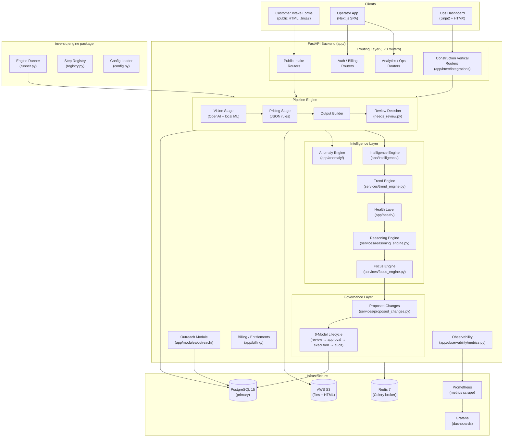

# Inversiq Engineering Handbook v2

_Version 2.0 — June 2026_
_Prepared by: Staff Engineering Review_
_Based on: direct repository analysis of the Inversiq codebase_

---

## Table of Contents

1. [Executive Summary](#1-executive-summary)
2. [Founder Vision](#2-founder-vision)
3. [High-Level Architecture](#3-high-level-architecture)
4. [Technology Stack](#4-technology-stack)
5. [Core Components](#5-core-components)
6. [Data Model Guide](#6-data-model-guide)
7. [Execution Lifecycle](#7-execution-lifecycle)
8. [Engineering Principles](#8-engineering-principles)
9. [Repository Guide](#9-repository-guide)
10. [Architectural Decision Records (ADRs)](#10-architectural-decision-records)
11. [Multi-Tenant Architecture](#11-multi-tenant-architecture)
12. [Observability Architecture](#12-observability-architecture)
13. [AI Strategy](#13-ai-strategy)
14. [Security Overview](#14-security-overview)
15. [Deployment Overview](#15-deployment-overview)
16. [Operational Playbook](#16-operational-playbook)
17. [Troubleshooting Guide](#17-troubleshooting-guide)
18. [Future Roadmap](#18-future-roadmap)

---

## 1. Executive Summary

Inversiq is a **decision infrastructure platform** for trade and service businesses. It automates the complete journey from customer inquiry to delivered estimate — replacing manual quoting, inconsistent pricing, and missed follow-up with a structured, observable, and continuously improving system.

### What the Platform Does

A construction operator receives a customer inquiry. The customer fills in an intake form and uploads photos. Inversiq's pipeline runs within seconds: photos are scored for quality by a local ML model, usable photos are analyzed by OpenAI Vision to extract area estimates and surface conditions, a JSON-rules-based pricing engine computes a line-item estimate, and a branded HTML estimate is delivered to the customer. If any step produces low confidence or detects damage that raises risk, the system routes the estimate to a human review queue instead.

After the deal closes, the operator records the outcome. Over time, the feedback loop feeds an intelligence layer: anomaly detection flags structural contradictions in run history, an intelligence engine detects behavioral patterns (systematic underpricing, repeated fallback usage), a trend engine classifies metric directions, a health layer produces pipeline health scores, a reasoning engine diagnoses root causes, and a governance layer surfaces proposed changes for human approval.

### Why It Matters

The addressable market is vast: millions of operators globally across construction, insurance, logistics, and real estate operate without systematic pricing infrastructure. CRMs help with pipeline management. Scheduling tools help with dispatch. No good generic solution exists for the core problem of turning a customer's vague request into a defensible, margin-protecting price. Inversiq is purpose-built for that gap.

### Technical Maturity

The construction vertical is production-grade with a complete pipeline: intake → vision → pricing → HTML delivery → feedback → intelligence loop. Two additional verticals (roofing, solar) are scaffolded with intake forms and adapters. The backend is a FastAPI application with 70+ mounted routers, a PostgreSQL primary database, Redis for task queuing, and AWS S3 for file storage. The frontend is a Next.js operator SPA. An emerging `inversiq.engine` package provides a formally typed, config-driven pipeline runner that will eventually become the universal execution substrate.

---

## 2. Founder Vision

### The Problem

Operational industries share a universal bottleneck: turning inbound customer interest into a priced, delivered quote takes too long, varies too much between operators, and produces outcomes that are hard to analyze or improve. A construction operator who receives 40 lead requests per week cannot manually visit all of them, price them consistently, or track which pricing decisions led to won or lost deals.

### The Architecture of the Solution

Inversiq is built around three commitments that distinguish it from generic SaaS tools:

**Determinism over magic.** Every output — pricing, review routing, confidence scoring, anomaly flags, proposed changes — is produced by explicit, inspectable rules. The reasoning at every step can be traced, audited, and challenged. When an estimate is wrong, engineers can replay the exact inputs and reproduce the output.

**Observability as a first-class product.** The system is instrumented not just for DevOps purposes but for business intelligence. Operators can see not only that a run failed but why, at what step, with what confidence score, using what pricing rules. Per-step input/output snapshots are stored as JSON on every pipeline execution. This observability layer is the foundation for the self-improvement loop.

**Human-in-the-loop governance.** The system identifies problems and proposes changes, but nothing is applied without explicit human approval. A six-model governance workflow (proposal → review → approval intent → execution request → execution attempt → outcome) exists because automated pricing changes in a B2B context carry real financial risk. The audit trail ensures every change is attributable.

### The Platform Direction

The immediate product is a Workflow Engine that automates the intake-to-estimate journey per vertical. Above that sits a Decision Infrastructure layer — analytical systems that observe pipeline behavior and produce structured, human-reviewable recommendations. The long-term vision is a horizontal platform that any operator-facing trade business can configure, with verticals added through registration rather than code changes.

---

## 3. High-Level Architecture

### System Architecture



### Major Services

| Service | Entry Point | Purpose |
|---|---|---|
| FastAPI App | `app/main.py` | HTTP API, routing (~70 routers), middleware |
| Construction Pipeline | `app/verticals/construction/pipeline.py` | Imperative estimation pipeline (production) |
| Engine Runner | `inversiq/engine/runner.py` | Config-driven pipeline runner (next-gen) |
| Vision Service | `app/tasks/vision_task.py` + `app/services/vision/` | OpenAI vision + photo quality screening |
| Pricing Engine | `app/verticals/construction/pricing_engine_us.py` | JSON-rules-based pricing |
| Review Decision | `app/verticals/construction/needs_review.py` | Hard/soft blocker review routing |
| Anomaly Engine | `app/anomaly/engine.py` | Structural contradiction detection |
| Intelligence Engine | `app/intelligence/engine.py` | Behavioral pattern detection |
| Trend Engine | `app/services/trend_engine.py` | Metric direction classification |
| Health Layer | `app/health/summary.py` | Pipeline/vertical health aggregation |
| Reasoning Engine | `app/services/reasoning_engine.py` | Root-cause diagnosis |
| Focus Engine | `app/services/focus_engine.py` | Operator attention queue prioritization |
| Proposed Changes | `app/services/proposed_changes.py` | Governance change proposal generation |
| Outreach Module | `app/modules/outreach/` | Email follow-up, reply classification, Gmail OAuth |
| Background Jobs | `app/jobs/runner.py` | In-process threaded job runner |
| Observability | `app/observability/metrics.py` | Prometheus metrics endpoint |

---

## 4. Technology Stack

### Verified Against `requirements.txt` and Repository

| Technology | Version/Notes | Role |
|---|---|---|
| Python | 3.11 (assumed from `from __future__ import annotations` style) | Primary backend language |
| FastAPI | latest (requirements.txt unpinned) | ASGI web framework |
| Gunicorn + UvicornWorker | latest | ASGI production server |
| SQLAlchemy | latest | ORM layer (modern `Mapped`/`mapped_column` style throughout) |
| SQLModel | listed in requirements.txt (presence only, may be legacy) | Pydantic-SQLAlchemy bridge |
| Alembic | listed in requirements.txt | Migration tooling (present but no migration files found) |
| PostgreSQL 15 | docker-compose.yml | Primary relational database |
| Redis 7 | docker-compose.yml | Celery broker and cache |
| Celery | via `app/celery_app.py`, `app/celery_tasks.py` | Distributed task queue |
| AWS S3 (boto3) | `app/aws/s3_ops.py` | Object storage (photos, HTML estimates) |
| OpenAI API | `app/services/vision/openai_provider.py` | Vision inference for photos |
| PyTorch + torchvision + timm | `app/ml/photo_qualtity/` | Local photo quality classifier |
| OpenCV (headless) | `app/ml/photo_qualtity/` | Image preprocessing |
| Stripe | `app/services/stripe_service.py`, `app/billing/` | Subscription billing |
| Prometheus | `app/observability/metrics.py` | Metrics exposition at `/metrics` |
| Grafana | `docker-compose.observability.yml` | Metrics dashboards |
| structlog + loguru | `app/core/logging_config.py` | Structured JSON logging |
| sentry-sdk | requirements.txt | Error tracking |
| slowapi | `app/core/rate_limit.py` | Rate limiting middleware |
| Jinja2 | `app/templates/`, vertical templates | Server-rendered HTML for ops dashboard |
| Next.js | `frontend/` | Operator SPA (TypeScript, App Router) |
| Google API client | `app/modules/outreach/services/gmail_provider.py` | Gmail OAuth for reply sync |
| WeasyPrint | requirements.txt | PDF generation capability (present) |
| PyJWT + passlib[bcrypt] | `app/auth/` | JWT authentication, password hashing |

### Key Dependency Notes

- **alembic is present** in requirements.txt but no migration files exist under `migrations/`. Schema creation uses `Base.metadata.create_all()` at startup controlled by `SQLALCHEMY_CREATE_ALL_AT_STARTUP` env var. This is appropriate for development but needs Alembic migrations before multi-instance production deploys.
- **sqlmodel** is listed but the codebase predominantly uses SQLAlchemy's native `Mapped`/`mapped_column` declarative style. SQLModel may be a legacy or transitional dependency.
- **WeasyPrint** is present for PDF generation. No PDF generation code was found in the verified paths, but it may exist in disabled/experimental routers.
- The internal API service name is `aether-api` (visible in startup logging `service=aether-api`), reflecting the platform's pre-productization name. Metrics are prefixed `aether_` accordingly.

---

## 5. Core Components

### 5.1 Vertical Registry System

The vertical registry (`app/verticals/registry.py`) is the plugin system for trade verticals. A `VERTICALS` dict maps vertical keys to registered vertical instances. Two protocols exist: `BaseVertical` (Python class with `key`, `label`, `get_workflows()`, etc.) and `VerticalAdapter` (structural protocol for adapters that implement `render_intake_form()` and `create_lead_from_form()`).

**Registered verticals (verified):**
- `painting` — `ConstructionVertical` (fully implemented, production-grade)


The `Tenant.sector` field is validated against registered verticals at model save time via a `@validates("sector")` decorator. This enforces data consistency at the ORM layer.

### 5.2 Execution Engine (Pipeline)

**Current production pipeline:** `app/verticals/construction/pipeline.py` — `compute_quote_for_lead()`

An imperative Python function that orchestrates five stages in sequence. No formal step registry — steps are direct function calls. Each stage's output feeds the next.

**Next-generation engine:** `inversiq/engine/runner.py` — `run_pipeline()`

A fully typed, config-driven pipeline runner. Steps are registered in a `StepRegistry`, step configurations are loaded from YAML (`inversiq/engine/config.py`), and execution is driven by iterating `config.steps`. The runner handles: PipelineRun DB persistence, per-step PipelineStepRun persistence, EngineEvent emission, confidence score accumulation (weakest-link min), structured logging via structlog, Prometheus metric emission, step contract validation, and error categorization. The runner is decoupled from the app layer via lazy imports.

**Key design:** The `ConstructionVertical.get_workflows()` method returns the step configuration list that will drive the engine runner when the migration from the imperative pipeline is complete. Eight steps are defined: `photo_quality`, `vision`, `aggregate`, `pricing`, `output`, `needs_review`, `render_html`, `store_html`.

### 5.3 Vision Layer

**Photo quality screening:** Local PyTorch/timm model in `app/ml/photo_qualtity/` (note: directory name has a typo — "qualtity" not "quality"). Training, evaluation, and export code exists. Inference via `app/services/photo_quality/inference.py`. Photos below the quality threshold are excluded before OpenAI API calls.

**Vision inference:** `app/services/vision/openai_provider.py` sends usable photos to the OpenAI Vision API with the prompt from `app/verticals/construction/prompts/vision.md`. A `fallback_provider.py` handles primary provider failures. `aggregate.py` combines per-image predictions into a lead-level result.

**Vertical-specific aggregation:** `app/verticals/construction/vision_aggregate_us.py` applies painting-domain logic to the raw image predictions.

**Output signals:** `area` (value_m2, confidence, sanity), `scope` (interior, paint_walls, paint_ceiling, paint_trim), `modifiers` (prep_level, complexity, risk), `vision_signal_confidence`, `uncertainty_score`, `coverage_score`, `needs_review`, `review_reasons`.

### 5.4 Pricing Engine

**Entry point:** `app/verticals/construction/pricing_engine_us.py` — `run_pricing_engine()`

Loads JSON rule sets (EU or US based on `lead.market`/locale), applies tenant pricing overrides from `Tenant.pricing_json`, and computes line-item estimates.

**Rule files:**
- `app/verticals/construction/rules/paintly_price_rules_eu.json` — EU rule set (verified)
- US rule set referenced by `_pick_rules_from_lead()` function

**Tenant overrides:** `Tenant.pricing_json` allows any rule parameter to be adjusted per tenant without modifying base rule files. Loaded and applied at runtime in `app/services/tenant_pricing.py`.

### 5.5 Review Decision Engine

**Entry point:** `app/verticals/construction/needs_review.py` — `needs_review_from_output()`

Returns a list of reason codes (empty list = auto-deliver; non-empty = needs human review).

**Hard blockers (immediate review):** missing total, zero/negative total.
**Soft signals:** low confidence, extreme area values, photo usability issues, high uncertainty, damage detection, high-impact damage severity.
**Stacking logic (Preset B):** auto-deliver unless 2+ soft signals accumulate.

Reason codes are explicit strings (e.g. `"risk:uncertainty_high"`, `"risk:coverage_low"`) — never just boolean flags.

### 5.6 Anomaly Engine

**Entry point:** `app/anomaly/engine.py` — `run_all()`
**Detectors (verified in `app/anomaly/detectors.py`):**

| Anomaly Type | Description |
|---|---|
| `PRICE_DELTA_LARGE` | Estimate price deviates >50% from baseline |
| `FAILED_HIGH_CONFIDENCE` | Run failed despite high confidence (logical contradiction) |
| `MISSING_STEP_OUTPUT` | Step completed but produced no output snapshot |
| `CONFIDENCE_ABSENT_ON_COMPLETION` | Completed run has no confidence score |
| `REPEATED_FAILURE` | Tenant has 3+ failures within a rolling 24-hour window |

All thresholds are caller-supplied parameters. The engine is composable — individual detector functions can be called directly.

### 5.7 Intelligence Engine

**Entry point:** `app/intelligence/engine.py` — `run_all()`
**Detectors (verified in `app/intelligence/detectors.py`):**

| Signal Type | Description |
|---|---|
| `LIKELY_UNDERPRICING` | Won deals consistently below estimate (threshold: 10%, min fraction: 60%, min sample: 5) |
| `LIKELY_OVERPRICING` | Loss rate exceeds 60% threshold |
| `REPEATED_LOW_CONFIDENCE` | Pipeline persistently produces low-confidence outputs (<0.40, min 5 runs) |
| `REPEATED_FALLBACK` | Pipeline repeatedly uses fallback vision provider (min 3 runs) |
| `REPEATED_REVIEW_FLAG` | Pipeline consistently routes to human review (min 3 runs) |

All thresholds are caller-supplied. Default lookback is 30 days.

### 5.8 Trend Engine

**Entry point:** `app/services/trend_engine.py` — `compute_scope_trend()`

Pure function — takes two metric dicts (current window, prior window), returns classified trend objects. No DB access, no state.

Metrics classified: `success_rate`, `failed_rate`, `review_rate`, `avg_confidence`, `fallback_rate`. Direction semantics: "up is good" for success/confidence; "down is good" for failed/review/fallback. Applies absolute and relative delta thresholds to distinguish stable from genuinely changing. Produces an aggregate scope-level direction and per-metric severity classification.

### 5.9 Health Layer

**Entry point:** `app/health/summary.py`

Aggregates PipelineRun counts and intelligence signals into health status per pipeline name and per vertical.

**Status thresholds (from `app/health/types.py`):**
- `unhealthy`: failed_rate, needs_review_rate, or low_confidence_rate exceeds unhealthy threshold; OR HIGH severity intelligence signal
- `watch`: exceeds watch threshold or has HIGH signal
- `healthy`: all rates below watch thresholds, no HIGH signals

Intelligence signals are run once per call to avoid redundant DB queries.

### 5.10 Reasoning Engine

**Entry point:** `app/services/reasoning_engine.py` — `compute_reasoning()`

Pure function over dicts. No ML, no DB queries. Takes health status, trend metrics, and signal counts; returns structured root-cause candidates ranked by evidence weight.

**Diagnostic categories:**
- `upstream_input_quality`
- `confidence_threshold_mismatch`
- `pricing_calibration_issue`
- `rule_coverage_gap`
- `operator_backlog`
- `anomaly_sensitivity_shift`
- `workflow_structure_inefficiency`
- `mixed_or_unclear`

Each candidate includes `category`, `root_cause`, `confidence`, `evidence` list, and `recommendations` list.

### 5.11 Focus Engine

**Entry point:** `app/services/focus_engine.py` — `compute_focus_score()`, `build_focus_item()`

Pure function. Produces a numeric priority score in [0, 100] and a priority label.

**Scoring formula:**
```
score = clamp(health_base + trend_modifier + signal_bonus, 0, 100)

health_base:    unhealthy=60, watch=30, healthy=5
trend_modifier: degrading high=+30, medium=+20, low=+10; improving=-5; stable=0
signal_bonus:   HIGH signal=+10/each, MEDIUM=+5/each, capped at +20 total

Priority tiers: critical ≥ 75 | high ≥ 50 | medium ≥ 25 | low < 25
```

### 5.12 Proposed Change Governance Layer

**Proposal generation:** `app/services/proposed_changes.py` — pure function, no DB access.

Maps reasoning categories to change types, assigns risk levels and approval types, generates stable deterministic change IDs (`scope_type:scope_id:category:parameter`), attaches preconditions, rollback hints, and evidence lists.

**Six-model lifecycle (all verified in `app/models/`):**

| Model | Purpose |
|---|---|
| `ProposedChangeReviewState` | Source of truth for operator review status. Unique on `(tenant_id, change_id)`. |
| `ProposedChangeApplyIntent` | Operator's explicit approval decision |
| `ProposedChangeExecutionRequest` | Request to execute an approved change |
| `ProposedChangeExecutionAttempt` | Individual execution attempt |
| `ProposedChangeExecutionOutcome` | Final outcome of execution |
| `ProposedChangeAuditEvent` | Immutable audit trail entry |

Additional services for related concerns: `proposal_conflicts.py`, `proposal_staleness.py`, `proposal_approval_readiness.py`, `proposal_apply_planning.py`, `proposal_governance_attestation.py`.

### 5.13 Outreach Module

**Location:** `app/modules/outreach/`

Manages automated follow-up communication with leads after estimate delivery.

**Verified components:**
- `models/outbound_message.py` — outbound message state tracking
- `models/message_reply.py` — incoming reply storage
- `models/outbound_suggestion.py` — system-generated follow-up suggestions
- `services/gmail_provider.py` — Gmail OAuth integration for reply sync
- `services/reply_classifier.py` — reply intent classification
- `services/followup_service.py` — follow-up message generation
- `services/reply_sync.py` — synchronizes incoming Gmail replies
- `services/email_sender.py` — outbound email sending
- `email_validation.py` — email address validation

### 5.14 Background Job System

Two job systems exist:

**In-process worker:** `app/jobs/runner.py` — a simple threaded polling loop that processes `Job` model records from the database. Polls every 5 seconds. Started at application startup via `start_worker()`. Processes jobs sequentially with a simulated 2-second sleep (development placeholder — not production-grade for heavy workloads).

**Celery worker:** `app/celery_app.py`, `app/celery_tasks.py` — distributed task queue using Redis as broker. Vision processing tasks run through `app/tasks/vision_task.py`.

### 5.15 Billing and Entitlements

**Entry point:** `app/billing/entitlements.py` — `check_entitlement()`

**Actions:** `SEND_QUOTE`, `EXPORT_PDF`, `USE_BRANDING`, `USE_WHITELABEL`

**Check sequence for `SEND_QUOTE`:**
1. Subscription must be accessible (active or within trial period)
2. Feature must be available on the plan (`BASIC_SENDING` feature)
3. Monthly usage must not exceed limit (from plan catalog + top-up credits)

`app/billing/features.py` maps plan codes to feature sets. `app/core/plan_catalog.py` defines monthly request limits per plan. Stripe webhooks in `app/routers/stripe_webhook.py` update subscription status.

---

## 6. Data Model Guide

### All Verified Models (`app/models/__init__.py`)

| Model | File | Purpose |
|---|---|---|
| `Lead` | `lead.py` | Central entity: customer request from intake to outcome |
| `LeadFile` | `lead.py` | Uploaded files attached to a lead |
| `Tenant` | `tenant.py` | Business customer (operator) of Inversiq |
| `TenantSettings` | `tenant_settings.py` | Per-tenant configuration settings |
| `User` | `user.py` | User accounts with tenant membership |
| `Job` | `job.py` | Background job queue records |
| `TenantUsage` | `tenant_usage.py` | Usage tracking (quotes sent, limits) |
| `LeadTrainingRecord` | `lead_training_record.py` | Records for ML training data collection |
| `CalendarConnection` | `calendar_connection.py` | Calendar OAuth connection |
| `QuoteCalendarLink` | `quote_calendar_link.py` | Links quotes to calendar events |
| `CalendarEvent` | `calendar_event.py` | Calendar event records |
| `PasswordResetToken` | `password_reset_token.py` | Password reset flow tokens |
| `PipelineRun` | `pipeline_run.py` | Pipeline execution record |
| `PipelineStepRun` | `pipeline_run.py` | Per-step execution record with snapshots |
| `RunReviewState` | `run_review_state.py` | Human review state for flagged pipeline runs |
| `LeadFeedback` | `lead_feedback.py` | Deal outcome and pricing accuracy |
| `ActivityEvent` | `activity_event.py` | Append-only user action log |
| `EngineEvent` | `engine_event.py` | Pipeline engine events (higher-level narrative) |
| `ProposedChangeReviewState` | `proposed_change_review_state.py` | Governance proposal review state |
| `ProposedChangeAuditEvent` | `proposed_change_audit_event.py` | Immutable audit trail |
| `ProposedChangeApplyIntent` | `proposed_change_apply_intent.py` | Operator approval intent |
| `ProposedChangeExecutionRequest` | `proposed_change_execution_request.py` | Execution request |
| `ProposedChangeExecutionAttempt` | `proposed_change_execution_attempt.py` | Execution attempt |
| `ProposedChangeExecutionOutcome` | `proposed_change_execution_outcome.py` | Execution outcome |
| `OutboundMessage` | `modules/outreach/models/` | Outbound follow-up message |
| `MessageReply` | `modules/outreach/models/` | Incoming reply |
| `OutboundSuggestion` | `modules/outreach/models/` | System-generated follow-up suggestion |
| `UploadRecord` | `upload_record.py` | Upload tracking record |

### Lead Model (Key Fields)

```
Lead
├── id                     UUID hex string PK
├── tenant_id              Multi-tenant scope (required)
├── vertical               Vertical ID (e.g. "painting", nullable)
├── name, email, phone     Customer contact
├── notes                  Freeform project description
├── status                 NEW → PROCESSING → DONE / NEEDS_REVIEW / FAILED
├── intake_payload         JSON string of form submission
├── estimate_json          JSON string of computed estimate
├── estimate_html_key      S3 key of rendered HTML
├── estimate_overrides_json Operator-applied manual overrides
├── final_price            Agreed final price (Numeric 12,2)
├── public_token           Token for customer-facing URL (unique)
├── sent_at, viewed_at, accepted_at  Quote lifecycle timestamps
├── reject_reason          Customer rejection reason
├── scheduled_start/end    Project scheduling
└── files: List[LeadFile]  Uploaded photos
```

### PipelineRun Model (Key Fields)

```
PipelineRun
├── id                     Integer PK
├── tenant_id, lead_id     Denormalized (no FK to leads)
├── vertical_id            Which vertical's pipeline ran
├── trace_id               Log correlation ID
├── pipeline_name          Pipeline identifier
├── engine_version         Engine version string
├── config_hash            12-char SHA-256 prefix of pipeline structure
├── status                 RUNNING → COMPLETED / FAILED / NEEDS_REVIEW
├── failure_step           Which step failed
├── error_category         transient | permanent | validation | external_dependency
├── overall_confidence_score  Weakest-link min of all step scores (nullable)
├── overall_confidence_label  high | medium | low
└── steps: List[PipelineStepRun]
```

### Tenant Model (Key Fields)

```
Tenant
├── id                     String PK (100 chars)
├── name, company_name     Display names
├── email, phone           Contact
├── slug                   URL-safe identifier for public routing
├── sector                 Validated against vertical registry
├── pricing_json           Tenant-specific pricing rule overrides
├── enabled_verticals      JSON list of accessible vertical IDs
├── stripe_customer_id, stripe_subscription_id  Billing
├── subscription_status, plan_code   Entitlement state
├── trial_ends_at          Trial period boundary
└── welcome_email_sent_at  Onboarding state
```

---

## 7. Execution Lifecycle

### Complete Pipeline Trace

```
[1. INTAKE]
  Customer submits form at /intake/{tenant_slug} (or /public/intake/{vertical})
  ├── Lead created in DB (status: NEW), tenant_id scoped
  ├── File upload via presigned S3 URLs (presign → upload → verify flow)
  └── Pipeline triggered

[2. VISION]
  app/tasks/vision_task.py → run_vision_for_lead()
  ├── Each photo scored: local PyTorch model (app/services/photo_quality/inference.py)
  ├── Usable photos → OpenAI Vision API
  │   └── Prompt: app/verticals/construction/prompts/vision.md
  ├── Per-image predictions aggregated (vision_aggregate_us.py)
  │   └── area_m2, scope, modifiers, damages, uncertainty, coverage
  └── Fallback: no files → _demo_vision() returns placeholder signals

[3. PRICING]
  app/verticals/construction/pricing_engine_us.py → run_pricing_engine()
  ├── Rules loaded from JSON (EU or US based on locale)
  ├── Tenant pricing overrides applied (Tenant.pricing_json)
  └── Output: line items, subtotals, VAT, grand total, assumptions

[4. OUTPUT BUILDER]
  app/verticals/construction/pricing_output_builder.py → build_pricing_output()
  ├── Merges vision metadata into estimate output
  └── Resolves branding (company name, logo) based on plan tier / entitlements

[5. REVIEW DECISION]
  app/verticals/construction/needs_review.py → needs_review_from_output()
  ├── Hard blockers: missing total, zero/negative total → REVIEW
  ├── Soft signals: low confidence, extreme areas, photo issues, damage
  └── Decision: auto-deliver if 0–1 soft signals; NEEDS_REVIEW if 2+

[6. HTML RENDER + S3 STORAGE]
  app/verticals/construction/render_estimate.py → render_estimate_html()
  ├── Jinja2 renders estimate to HTML
  ├── HTML stored in S3: leads/{lead_id}/estimates/{date}/{uuid}.html
  └── public_token generated if not yet set

[7. DELIVERY]
  ├── Email sent to customer with estimate link
  ├── Customer views at /estimate/{public_token} → viewed_at set
  └── Customer accepts or rejects → timestamps / reject_reason recorded

[8. FEEDBACK]
  app/routers/lead_feedback.py
  ├── Operator records outcome: won/lost, actual_price
  └── LeadFeedback persisted

[9. INTELLIGENCE LOOP (periodic / on-demand)]
  ├── Metrics aggregated per pipeline / vertical (app/services/metrics_aggregation.py)
  ├── Anomaly engine (app/anomaly/engine.py) → structural contradictions flagged
  ├── Intelligence engine (app/intelligence/engine.py) → behavioral patterns detected
  ├── Trend engine (app/services/trend_engine.py) → current vs prior window comparison
  ├── Health layer (app/health/summary.py) → pipeline/vertical health scores
  ├── Reasoning engine (app/services/reasoning_engine.py) → root causes diagnosed
  ├── Focus engine (app/services/focus_engine.py) → operator attention queue
  └── Proposed changes (app/services/proposed_changes.py) → operator review queue
```

### Governance Lifecycle

```
ProposedChange (generated by compute_proposed_changes())
  └── persisted as ProposedChangeReviewState (status: "pending")
        └── operator reviews
              ├── APPROVED → ProposedChangeApplyIntent created
              │     └── ProposedChangeExecutionRequest created
              │           └── ProposedChangeExecutionAttempt (per try)
              │                 └── ProposedChangeExecutionOutcome (final)
              │                       └── ProposedChangeAuditEvent (immutable)
              └── REJECTED → ProposedChangeReviewState (status: "rejected")
                                └── ProposedChangeAuditEvent (immutable)
```

---

## 8. Engineering Principles

### 1. Determinism Over Magic

Every output the system produces — estimates, confidence scores, anomaly flags, proposed changes — can be reproduced by re-running the same inputs through the same code. Non-determinism exists only at the OpenAI API boundary.

Structurally enforced by:
- Pricing rules are JSON files, not database state
- Reasoning engine is a pure function over dicts
- Proposed changes generate stable IDs from deterministic inputs
- `config_hash` on `PipelineRun` captures pipeline structure

### 2. Observability First

Observability is a product feature, not a DevOps afterthought. Per-step input/output snapshots, per-step confidence scores, EngineEvents, and structured log binding are embedded in the execution infrastructure itself. The intelligence layer is only possible because the pipeline produces rich, queryable telemetry.

### 3. Human-in-the-Loop Governance

Nothing is applied without explicit human approval. The six-model governance workflow and permanent audit trail ensure every system-suggested change is attributable and reversible. This is not a UX decision — it is an architectural commitment for a platform that affects real pricing and margin outcomes.

### 4. Confidence as a First-Class Signal

Every pipeline step that produces meaningful output is expected to produce a confidence score. Steps that cannot produce one create an observability gap (flagged by `CONFIDENCE_ABSENT_ON_COMPLETION`). The weakest-link minimum is the overall run confidence. The system distinguishes "I am certain" from "I am guessing" — this drives review routing.

### 5. Explicit Rules Over Learned Models

Pricing, review decision, reasoning, trend classification, and focus scoring are all explicit, readable rules. The only learned inference is at the OpenAI Vision API boundary and the local photo quality classifier. Rules are auditable, debuggable, and changeable through the governance process.

### 6. Pure Functions for Analysis

The reasoning engine, trend engine, focus engine, and proposed changes generator are all pure functions: they take data in, return data out, have no side effects, and access no database. This makes them trivially testable, composable, and safe for simulation mode.

### 7. Multi-Tenancy by Default

Every entity carries `tenant_id`. Database queries scope to tenant by default. There is no global mutable state except platform-level configuration.

### 8. Config Over Code for Verticals

New verticals register through the vertical registry. The `ConstructionVertical.get_workflows()` method defines the step sequence as configuration. The `inversiq.engine` runner executes whatever steps are configured. The goal: new verticals through registration, not architecture changes.

---

## 9. Repository Guide

### Verified Folder Structure

```
Inversiq/
├── app/                          # Main application package
│   ├── main.py                   # Entry point: ~70 routers, middleware, startup
│   ├── models/                   # 29 SQLAlchemy model files (+ outreach models)
│   ├── routers/                  # ~70 FastAPI router files
│   ├── services/                 # ~60 business logic services
│   ├── verticals/
│   │   ├── base.py               # BaseVertical abstract class
│   │   ├── registry.py           # VERTICALS dict, register/get functions
│   │   └── construction/         # Fully implemented (pipeline, pricing, vision, templates)


│   ├── intelligence/             # Behavioral pattern detectors
│   ├── anomaly/                  # Structural anomaly detectors
│   ├── health/                   # Pipeline/vertical health aggregation
│   ├── auth/                     # JWT authentication, password hashing
│   ├── billing/                  # Stripe entitlements, plan features
│   ├── modules/
│   │   └── outreach/             # Email follow-up module (models, repos, services)
│   ├── observability/            # Prometheus metrics router
│   ├── aws/                      # S3 operations and error handling
│   ├── db/                       # SQLAlchemy session and Base
│   ├── core/                     # Settings, logging, contracts, rate limiting
│   ├── tasks/                    # Celery vision tasks
│   ├── jobs/                     # In-process background job runner
│   ├── ml/                       # Photo quality model training/eval/export
│   ├── templates/                # Jinja2 ops dashboard templates
│   ├── i18n/                     # en.json, nl.json translation files
│   ├── schemas/                  # Pydantic request/response schemas
│   ├── security/                 # BasicAuth middleware
│   └── static/                   # Static assets
├── frontend/                     # Next.js operator SPA (TypeScript, App Router)
│   └── src/
│       ├── app/                  # Next.js App Router pages
│       └── components/           # React components (dashboard, billing, layout)
├── inversiq/                     # Engine abstraction package
│   └── engine/                   # runner.py, config.py, registry.py, context.py, assets.py, facade.py, rules_loader.py
├── docs/                         # Documentation
├── docker-compose.yml            # Core stack (app, postgres, redis)
├── docker-compose.dev.yml        # Local development overrides
├── docker-compose.observability.yml  # Prometheus + Grafana
├── docker-compose.redis.yml      # Redis-only dev
├── Dockerfile                    # Application image
├── requirements.txt              # Python dependencies
└── pyproject.toml                # Project metadata
```

### Actual Router Count

`main.py` mounts **68 individual routers** (verified by counting `app.include_router()` calls). The handbook's claim of "roughly 60 routers" was an undercount.

### Entry Points for Reading

| Goal | Start Here |
|---|---|
| Understand the business | `app/verticals/construction/pipeline.py` |
| Understand routing | `app/main.py` |
| Understand data model | `app/models/__init__.py` → `lead.py` → `pipeline_run.py` |
| Understand intelligence | `app/intelligence/engine.py` → `app/services/trend_engine.py` → `app/services/reasoning_engine.py` |
| Understand governance | `app/services/proposed_changes.py` → `app/models/proposed_change_review_state.py` |
| Understand multi-tenancy | `app/models/tenant.py` → `app/verticals/registry.py` |
| Understand the next-gen engine | `inversiq/engine/runner.py` → `inversiq/engine/config.py` |
| Add a new vertical | `app/verticals/roofing/__init__.py` side-by-side with `app/verticals/construction/__init__.py` |

---

## 10. Architectural Decision Records

### ADR-001: Weakest-Link Confidence Model

**Decision:** Overall pipeline confidence is `min(all_step_confidence_scores)`.
**Context:** Early iterations considered averaging confidence scores. A step that produces garbage output with 0.2 confidence but passes through averaging at 0.7 overall is dangerous.
**Rationale:** A chain is as strong as its weakest link. A single step with low confidence is sufficient reason to trigger human review. Conservative by design.
**Consequences:** Any step can veto auto-delivery. This increases the review queue volume but prevents confident-but-wrong estimates from reaching customers.

### ADR-002: Proposed Changes as Pure Functions

**Decision:** `compute_proposed_changes()` is a pure function with no DB access.
**Context:** Proposals are derived from signals and reasoning. If generation were coupled to persistence, simulation mode (`/simulation_preview`) would require mocking or transactions.
**Rationale:** Pure functions are testable without infrastructure, composable with any orchestration layer, and safe to call speculatively. Persistence is the caller's responsibility.
**Consequences:** The caller must explicitly persist proposals. This is slightly more verbose but enables simulation mode and decouples the intelligence layer from the data layer.

### ADR-003: Deterministic Change IDs for Proposals

**Decision:** Change IDs are stable, deterministic strings: `{scope_type}:{scope_id}:{category}:{parameter}`.
**Context:** If proposals were assigned random IDs, the same proposal could be generated multiple times and persist as duplicates. Operators would see noise in their review queue.
**Rationale:** Stable IDs mean the same system state always produces the same proposal ID. The `(tenant_id, change_id)` unique constraint on `ProposedChangeReviewState` prevents duplicates.
**Consequences:** If a proposal's scope or category changes, it gets a new ID. Old review states are not automatically migrated. This is intentional — a different proposal ID represents a meaningfully different proposal.

### ADR-004: Denormalized `tenant_id` on `PipelineRun`

**Decision:** `PipelineRun.tenant_id` is stored directly (no foreign key to the `tenants` table).
**Context:** The engine is designed to be generic — it should not have hard dependencies on the application's tenant model.
**Rationale:** Denormalization keeps the engine decoupled from the app layer. PipelineRun records can be queried by tenant without joining through the leads table or the tenants table. Foreign key omission is also noted in code comments: "no FK to leads to keep engine generic."
**Consequences:** No referential integrity enforcement on `tenant_id` in `pipeline_runs`. Orphaned run records are possible if tenant data is purged without cascading. Acceptable for the current stage.

### ADR-005: Dual Pipeline (Imperative + Engine Runner)

**Decision:** The production pipeline (`app/verticals/construction/pipeline.py`) is an imperative function while the engine runner (`inversiq/engine/runner.py`) is the next-generation abstraction. Both coexist.
**Context:** Migrating to the engine runner is a significant refactor. The `ConstructionVertical.get_workflows()` step definition exists but the engine runner is not yet driving production traffic.
**Rationale:** Coexistence allows incremental migration without production risk. The engine runner is exercised through `pipeline_engine.py` while the imperative pipeline handles production load.
**Consequences:** Two execution paths to maintain. Engineers must understand which path is active. The engine runner has richer observability (EngineEvent emission, structured logging via structlog) — this is a strong pull toward completing the migration.

### ADR-006: No Static AWS Keys at Startup

**Decision:** Application fails to start if `AWS_ACCESS_KEY_ID`, `AWS_SECRET_ACCESS_KEY`, or `AWS_SESSION_TOKEN` are present in environment variables.
**Context:** Static AWS credentials in environment variables are a common security antipattern. They leak through environment dumps, log scraping, and container image layers.
**Rationale:** IAM roles (production) or AWS profiles (local) are the correct credential mechanism. The startup guard makes the policy machine-enforceable.
**Consequences:** Local development requires either `AWS_PROFILE` configuration or the mock storage backend (`app/mock_storage/`).

### ADR-007: Server-Side HTML for Ops Dashboard

**Decision:** The operator application dual-surfaces: Next.js SPA for the main operator interface, Jinja2-rendered HTML with HTMX for the construction vertical's ops dashboard.
**Context:** The ops dashboard was built before the Next.js SPA. HTMX partial updates allowed interactive behavior without a full React frontend.
**Rationale:** Pragmatic — the ops dashboard needed to ship fast. The Next.js SPA is the long-term direction but the Jinja2/HTMX surface continues to serve real operators.
**Consequences:** Two frontend paradigms to maintain. Engineers need familiarity with both. The Jinja2 templates are in `app/verticals/construction/templates/app/`.

---

## 11. Multi-Tenant Architecture

### Isolation Model

Every entity in the system carries `tenant_id`. Isolation is enforced at the application query layer, not at the database schema layer (there is no per-tenant schema or database). This is a shared-schema multi-tenancy model.

**Tenant identification in requests:**
- `X-Tenant-ID` header (logged by middleware)
- `tenant_id` in JWT tokens (via `app/auth/`)
- `slug` for public intake routing (`/intake/{slug}`)

**Tenant configuration:**
- `sector` — which vertical the tenant operates in (validated at model save)
- `enabled_verticals` — list of vertical IDs accessible (None → defaults to ["painting"])
- `pricing_json` — tenant-specific rule overrides applied at pipeline time
- `plan_code` — determines feature entitlements and usage limits

**Data scoping (verified patterns):**
- `PipelineRun` queries filter by `tenant_id`
- `LeadFeedback` queries scope to tenant
- Intelligence and health queries accept `tenant_id` parameter
- `ProposedChangeReviewState` has unique constraint on `(tenant_id, change_id)`

### Vertical Routing

When a request arrives at a public intake endpoint, the vertical is resolved from:
1. The URL path (`/intake/roofing`, `/intake/solar`)
2. The tenant's `sector` field (default routing)
3. The `vertical` field on the Lead (set at creation)

The `Tenant.get_vertical()` method resolves the vertical instance from the registry, falling back to "construction" when `sector` is unset.

---

## 12. Observability Architecture

### Layers of Observability

**Infrastructure metrics (Prometheus):**
- `aether_presign_total` — presign request counter by result
- `aether_verify_total` — upload verify counter by result
- `aether_upload_size_bytes` — upload size histogram
- `aether_api_latency_seconds` — API latency histogram by route
- Pipeline-level metrics emitted by `inversiq/engine/runner.py` via `app.metrics`

**Structured logging (structlog):**
Every request logs: `request_id`, `tenant_id`, `ip`, `endpoint`, `method`, `status_code`, `latency_ms`.
Engine runner logs: `pipeline_start`, `step_start`, `step_end`, `step_exception`, `pipeline_succeeded`, `pipeline_failed`.
Branding decisions are logged at estimate generation time.

**EngineEvents (DB):**
Events emitted at: `pipeline.started`, `pipeline.step.started`, `pipeline.step.completed`, `pipeline.step.failed`, `pipeline.step.needs_review`, `pipeline.completed`, `pipeline.failed`, `pipeline.needs_review`.
Stored in `engine_events` table with tenant/lead/trace correlation.

**PipelineRun/PipelineStepRun (DB):**
Complete execution trace with per-step input/output snapshots (size-capped to 20 keys, strings truncated at 400 chars), confidence scores, duration_ms, error categorization, and config_hash.

**ActivityEvent (DB):**
Append-only log of user actions. Feeds the operator activity feed.

**Error tracking (Sentry):**
Unhandled exceptions captured with full request context.

### Dashboarding

`docker-compose.observability.yml` provisions Prometheus and Grafana. Prometheus scrapes the `/metrics` endpoint. Grafana dashboards are not yet deeply configured in the codebase — infrastructure is provisioned but dashboard definitions are outstanding.

### Intelligence as Observability

The anomaly and intelligence engines are themselves an observability layer — they query operational data (PipelineRun, LeadFeedback) and produce structured signals that surface systemic issues. This elevates observability from "log queries" to "automated pattern detection."

---

## 13. AI Strategy

### Current AI Usage

**OpenAI Vision API (production, revenue-critical):**
Used in `app/services/vision/openai_provider.py`. Analyzes customer-uploaded photos to extract: area estimates (m²), surface conditions, scope (interior/exterior/ceiling/trim), preparation level, complexity, damage signals, and uncertainty/coverage scores. The vision prompt (`app/verticals/construction/prompts/vision.md`) is a key IP asset.

**Photo quality classifier (local, cost-optimization):**
PyTorch/timm model in `app/ml/photo_qualtity/` screens photos before sending to OpenAI. Excludes blurry, dark, or irrelevant images to reduce API cost. Training, evaluation, and export infrastructure exists in the repository.

**Reply classifier (outreach):**
`app/modules/outreach/services/reply_classifier.py` classifies incoming email reply intent (interested, not interested, already hired, etc.). Implementation details not read in detail.

### AI Architecture Principles

**AI is one layer in a deterministic pipeline, not the pipeline itself.** Vision inference is a single step whose output is then processed by explicit rules. The pricing engine, review decision, and governance layer are all explicit code — not models.

**Fallback paths exist.** `app/services/vision/fallback_provider.py` handles OpenAI failures. `_demo_vision()` in the pipeline handles leads with no uploaded photos. The system gracefully degrades rather than failing hard.

**AI costs are metered.** The photo quality classifier exists specifically to reduce OpenAI API spend. This signals intentional cost management as the platform scales.

### AI Strategy Direction

The platform's trajectory is toward a **closed learning loop**:
- Pipeline runs generate telemetry
- LeadFeedback provides ground truth on pricing accuracy
- The intelligence layer detects systematic pricing errors
- Proposed changes surface recalibration recommendations
- Human approval gates rule changes

This is a human-supervised continuous improvement system, not autonomous AI learning. The constraint is intentional: pricing rule changes have real financial consequences and require operator accountability.

---

## 14. Security Overview

### Authentication and Authorization

**JWT-based auth:** `app/auth/` handles token generation, validation, and user lookup. `PyJWT` and `passlib[bcrypt]` are the implementation libraries.

**Basic auth guard:** `BasicAuthMiddleware` (in `app/security/basic_auth.py`) protects `/sales` and `/api` path prefixes. Configured via `settings`.

**Password hashing:** `passlib[bcrypt]==1.7.4` with explicit version pin (security-sensitive dependency).

**Password reset:** `PasswordResetToken` model and `app/services/password_reset_service.py` handle secure reset flow.

### AWS Credential Security

`assert_no_static_aws_keys_in_env()` runs at startup and raises `RuntimeError` if `AWS_ACCESS_KEY_ID`, `AWS_SECRET_ACCESS_KEY`, or `AWS_SESSION_TOKEN` are present in the environment. IAM roles (production) or AWS profiles (local development) are required. This is machine-enforced policy.

### Input Validation

- **Pydantic validation** on all FastAPI request bodies
- **JSON Schema validation** on intake form submissions (`app/verticals/construction/intake_schema.json`)
- **ORM-level validation** on `Tenant.sector` via `@validates("sector")` decorator
- **Email validation** via `email-validator` dependency

### Rate Limiting

`SlowAPIMiddleware` (slowapi library) provides rate limiting. Limiter instance configured in `app/core/rate_limit.py`. Rate limit exceeded returns HTTP 429.

### CORS

`CORSMiddleware` configured from `settings.allowed_origins_list`. Allows credentials. Methods and headers are open (`["*"]`) — suitable for the API-frontend model where CORS is a browser-side protection, not a security boundary.

### Known Security Posture Gaps

- No Alembic migrations means schema drift risk in multi-instance deploys
- No row-level security in PostgreSQL — isolation is application-layer only
- CORS `allow_methods=["*"]` and `allow_headers=["*"]` are permissive
- The in-process job runner (`app/jobs/runner.py`) uses a `time.sleep(2)` stub — not production-ready for actual job processing

---

## 15. Deployment Overview

### Docker Compose Stacks

| File | Purpose |
|---|---|
| `docker-compose.yml` | Core stack: app (Gunicorn+Uvicorn), PostgreSQL 15, Redis 7 |
| `docker-compose.dev.yml` | Local development overrides |
| `docker-compose.observability.yml` | Prometheus + Grafana |
| `docker-compose.redis.yml` | Redis-only for development |

### Application Server

Production command: `gunicorn -k uvicorn.workers.UvicornWorker app.main:app --bind 0.0.0.0:8080`

### Startup Sequence

1. `load_dotenv()` loads environment
2. `setup_logging()` configures structlog
3. FastAPI application instantiated
4. `register_verticals(app)` registers painting/roofing/solar
5. Static files mounted at `/static`
6. Middleware stack assembled (RequestId → SlowAPI → BasicAuth → CORS → HTTP logging)
7. 68 routers mounted
8. On startup event:
   - `assert_no_static_aws_keys_in_env()` (hard fail if violated)
   - `Base.metadata.create_all()` if `SQLALCHEMY_CREATE_ALL_AT_STARTUP=true`
   - `start_worker()` launches in-process background job thread

### Environment Variables

Key variables (configured via `.env`):

| Variable | Purpose |
|---|---|
| `DATABASE_URL` | PostgreSQL connection (or SQLite for dev) |
| `REDIS_URL` | Redis connection (`redis://redis:6379/0`) |
| `OPENAI_API_KEY` | OpenAI Vision API |
| `STRIPE_SECRET_KEY`, `STRIPE_WEBHOOK_SECRET` | Stripe billing |
| `AWS_PROFILE` or IAM role | AWS S3 access (static keys blocked) |
| `SQLALCHEMY_CREATE_ALL_AT_STARTUP` | `true` for dev; `false` for Gunicorn multi-worker |
| `ENABLE_DEV_ROUTES` | Enables debug_aws and vision_debug routers |
| `APP_NAME`, `APP_VERSION` | FastAPI metadata |

### Frontend Deployment

The Next.js frontend (`frontend/`) is a separate deployment target. It communicates with the backend via a catch-all API proxy (`frontend/src/app/api/backend/[...path]/route.ts`). This proxy pattern decouples the frontend deployment from the backend URL.

---

## 16. Operational Playbook

### Adding a New Tenant

1. Create a `Tenant` record with `sector` set to a registered vertical key
2. Set `slug` for public intake URL routing
3. Configure `pricing_json` with any vertical-specific overrides
4. Set `plan_code` and trigger Stripe subscription creation
5. Send welcome email via `app/services/onboarding_email_service.py`

### Running the Intelligence Loop

The intelligence loop is on-demand (no scheduled job in current codebase). To run:
1. `GET /anomalies?tenant_id={id}` — anomaly detection
2. `GET /intelligence?tenant_id={id}` — behavioral signals
3. `GET /trends?tenant_id={id}` — trend classification
4. `GET /health?tenant_id={id}` — health summary
5. `GET /reasoning?tenant_id={id}` — root-cause diagnosis
6. `GET /focus?tenant_id={id}` — priority queue
7. `GET /proposed-changes?tenant_id={id}` — generate proposals

### Reviewing a Failed Pipeline Run

1. Query `GET /pipeline-runs?tenant_id={id}&status=FAILED`
2. Inspect `failure_step` and `error_category` on the run
3. Fetch `GET /pipeline-runs/{run_id}/steps` for step-level detail
4. Inspect `input_snapshot` and `output_snapshot` on the failing step
5. Check `GET /engine-events?lead_id={id}` for higher-level event narrative

### Approving a Proposed Change

1. `GET /proposed-changes?tenant_id={id}` — view pending proposals
2. Review `proposal_payload`, `risk_level`, `preconditions`, `rollback_hint`
3. Use `/simulation_preview` to see what the change would produce
4. `POST /proposed-change-apply-intents` — record approval intent
5. `POST /proposed-change-execution-requests` — trigger execution
6. Monitor via `GET /proposed-change-execution-outcomes`
7. Full audit trail at `GET /proposed-change-audit?tenant_id={id}`

---

## 17. Troubleshooting Guide

### Issue: Pipeline produces `FAILED` runs

**Check:** `PipelineRun.error_category` — taxonomy: `transient | permanent | validation | external_dependency`
**Check:** `PipelineRun.failure_step` — which step failed
**Check:** `PipelineStepRun.error_message` and `error_type` for the failing step
**Common causes:**
- `external_dependency` — OpenAI API unavailable or rate-limited (transient, retry)
- `validation` — intake payload missing required fields (permanent, needs operator action)
- `permanent` — pricing rule missing for lead's market/locale combination

### Issue: Estimate always routes to NEEDS_REVIEW

**Check:** `Lead.estimate_json` → `meta.needs_review_reasons` — explicit list of reason codes
**Check:** Vision signals: `vision_signal_confidence`, `vision_uncertainty_score`, `vision_coverage_score`
**Common causes:**
- All photos scoring low on usability → demo_vision() used → `review_reasons: ["demo_mode"]`
- OpenAI returning high uncertainty scores
- Multiple soft signals stacking (Preset B logic: 2+ soft signals → review)

### Issue: Intelligence signals fire spuriously

**Check:** Signal thresholds are caller-supplied. Default `lookback_days=30`, `min_sample=5`.
**Action:** Increase `min_sample` or `lookback_days` parameters to require more evidence before firing

### Issue: `assert_no_static_aws_keys_in_env` fails at startup

**Fix:** Remove `AWS_ACCESS_KEY_ID`, `AWS_SECRET_ACCESS_KEY`, `AWS_SESSION_TOKEN` from environment.
**Use instead:** `AWS_PROFILE` for local dev, IAM role for production, mock storage (`USE_MOCK_STORAGE=true`) for tests without AWS.

### Issue: `SQLALCHEMY_CREATE_ALL_AT_STARTUP` race condition

**Symptom:** Multiple Gunicorn workers simultaneously attempt schema creation → race condition errors.
**Fix:** Set `SQLALCHEMY_CREATE_ALL_AT_STARTUP=false` for multi-worker Gunicorn. Run migrations separately (Alembic setup needed).

---

## 18. Future Roadmap

Items documented in the original handbook, verified as confirmed gaps in the repository:

### 1. Complete the `inversiq.engine` Migration (High Priority)

The engine runner (`inversiq/engine/runner.py`) is fully implemented with richer observability than the imperative pipeline. The `ConstructionVertical.get_workflows()` step definition exists. The missing piece is wiring the engine runner to replace the production pipeline.

**Impact:** Config-driven pipelines, portable step registry, automatic config_hash tracking, better step contract enforcement.

### 2. Alembic Migration Infrastructure (High Priority)

`alembic` is present in `requirements.txt`. No migration files exist. Schema creation via `create_all()` at startup is a development pattern, not a production pattern.

**Impact prerequisite for:** Zero-downtime schema changes, multi-instance production deployment safety, rollback capability.

### 3. Decouple Vision Processing from HTTP Path

Vision processing (OpenAI API calls) currently blocks the HTTP response. Celery infrastructure exists but integration into the main pipeline is partial. The intake endpoint could return immediately; vision processing completes asynchronously.

**Impact:** Faster HTTP responses, retry logic for transient OpenAI errors, better throughput under load.

### 4. Scheduled Intelligence Runs

The intelligence loop is currently on-demand. No scheduled job triggers it automatically. A nightly scheduler would: aggregate recent feedback, run anomaly+intelligence engines, compute trends, generate and persist proposals to the review queue.

**Impact:** Transforms intelligence from a diagnostic tool into a continuous operational feedback loop.

### 5. Pricing Rule Versioning and Governance

Pricing rules are JSON files in the repository. Tenant overrides are in `Tenant.pricing_json`. Neither has version history, diff view, or connection to the proposed-change governance workflow. Storing rule sets in the database and routing changes through `ProposedChangeReviewState` would close the governance loop.

### 6. Insurance, Logistics, and Real Estate Pipelines

These verticals are next in the expansion roadmap. Each will follow the Construction vertical as the reference implementation: intake → adapter → pipeline → pricing engine → output template.

### 7. Confidence Score Calibration

Confidence thresholds (review at <0.45, low-confidence signal at <0.40) are fixed constants. Using `LeadFeedback` records to calibrate thresholds — if auto-delivered runs at 0.45–0.55 consistently produce won deals, the threshold can safely be lowered — would close the calibration loop.

---

_This handbook is based on direct repository analysis as of June 2026. Every statement is grounded in code evidence. When behavior was unclear, it is noted explicitly. The authoritative source of truth for any specific behavior is always the code._
