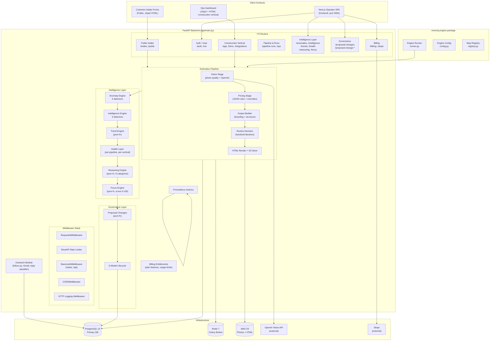
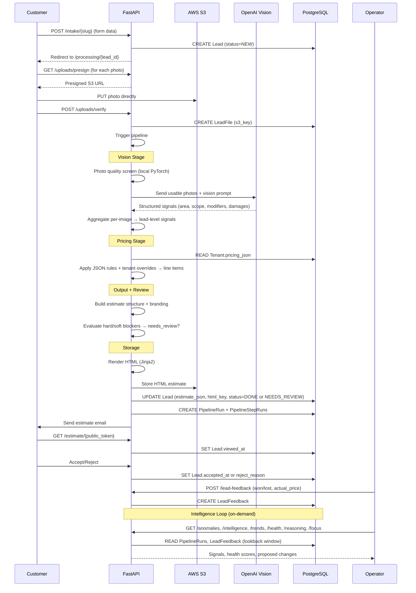
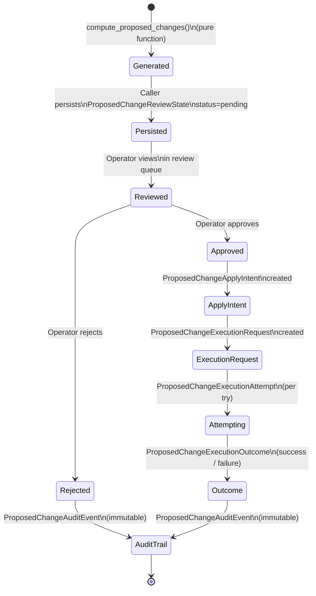
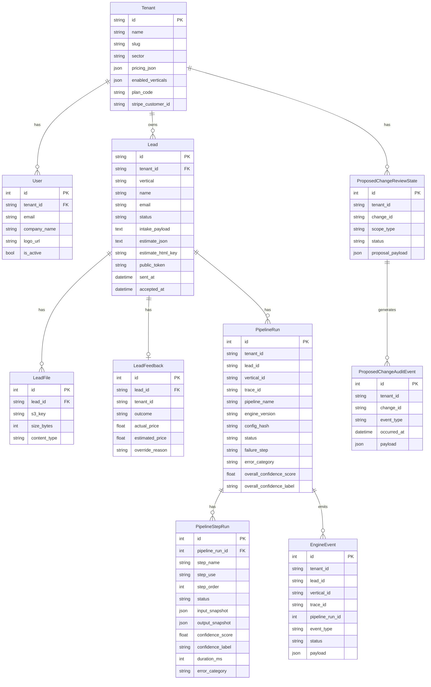
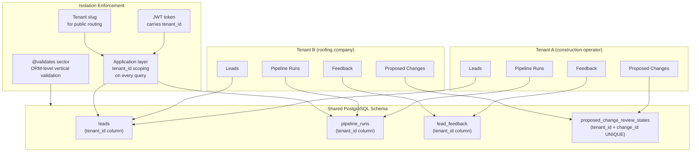

# System Diagrams

_Inversiq — June 2026_
_All diagrams are Mermaid. Render with any Mermaid-compatible viewer._

---

## 1. System Architecture Map



---

## 2. Data Flow Map (Intake to Intelligence)



---

## 3. Pipeline Execution Flow

```mermaid
flowchart TD
    START([Lead Created\nstatus=NEW]) --> FILES{Any uploaded\nphoto files?}

    FILES -->|Yes| QS[Photo Quality Screening\nlocal PyTorch/timm model]
    FILES -->|No| DEMO[Demo Vision\nfallback signals\n75m2 / light prep]

    QS --> USABLE{Usable photos?}
    USABLE -->|Yes| OPENAI[OpenAI Vision API\nvision.md prompt\narea, scope, modifiers, damages]
    USABLE -->|No| DEMO

    OPENAI --> AGG[Vision Aggregate\nvision_aggregate_us.py\nper-image → lead-level signals]
    DEMO --> AGG

    AGG --> PRICING[Pricing Engine\nprice_rules_eu/us.json\n+ Tenant.pricing_json overrides\n→ line items, totals, VAT]

    PRICING --> OUTPUT[Output Builder\npricing_output_builder.py\nmerge vision meta + branding]

    OUTPUT --> REVIEW{Review Decision\nneeds_review_from_output}

    REVIEW -->|Hard blocker:\nmissing/zero total| NEEDSREV[status = NEEDS_REVIEW\nreason codes set]
    REVIEW -->|2+ soft signals\nstacking| NEEDSREV
    REVIEW -->|0-1 soft signals| AUTODELIVER

    AUTODELIVER[Auto-deliver path] --> HTML[Render HTML\nJinja2 template]
    NEEDSREV --> HTML

    HTML --> STORE[Store to S3\nleads/{id}/estimates/{date}/{uuid}.html]
    STORE --> TOKEN[Generate public_token\nif not exists]
    TOKEN --> DONE([Return estimate_json\nestimate_html_key\nneeds_review])

    DONE --> PIPELINE_RUN[(PipelineRun\nCOMPLETED/NEEDS_REVIEW\nwith step runs + snapshots)]
```

---

## 4. Intelligence Loop Flow

```mermaid
flowchart LR
    subgraph DATA["Source Data"]
        PR["PipelineRun\n+ PipelineStepRun\n(run history)"]
        LF["LeadFeedback\n(won/lost, prices)"]
    end

    subgraph ANOMALY["Anomaly Engine\napp/anomaly/"]
        A1["PRICE_DELTA_LARGE\n>50% from baseline"]
        A2["FAILED_HIGH_CONFIDENCE\nlogical contradiction"]
        A3["MISSING_STEP_OUTPUT\nobservability gap"]
        A4["CONFIDENCE_ABSENT\non completion"]
        A5["REPEATED_FAILURE\n3+ in 24h window"]
    end

    subgraph INTEL["Intelligence Engine\napp/intelligence/"]
        I1["LIKELY_UNDERPRICING\n10%+ below, 60%+ fraction"]
        I2["LIKELY_OVERPRICING\n60%+ loss rate"]
        I3["REPEATED_LOW_CONFIDENCE\n<0.40 on 5+ runs"]
        I4["REPEATED_FALLBACK\n3+ fallback runs"]
        I5["REPEATED_REVIEW_FLAG\n3+ review-routed runs"]
    end

    subgraph ANALYSIS["Analysis Layer"]
        TREND["Trend Engine\ncurrent vs prior window\nper-metric direction + severity"]
        HEALTH["Health Layer\nhealthy / watch / unhealthy\nper pipeline_name + per vertical"]
        REASON["Reasoning Engine\n8 diagnostic categories\npure function"]
        FOCUS["Focus Engine\nscore = health + trend + signals\npriority: critical/high/medium/low"]
    end

    subgraph GOVERN["Governance"]
        PROP["Proposed Changes\nchange_id = scope:category:param\nrisk_level, rollback_hint"]
        STATE["ProposedChangeReviewState\npending / approved / rejected"]
        AUDIT["ProposedChangeAuditEvent\nimmutable trail"]
    end

    PR --> ANOMALY
    PR --> INTEL
    LF --> INTEL

    ANOMALY --> HEALTH
    INTEL --> HEALTH
    INTEL --> TREND
    TREND --> REASON
    HEALTH --> REASON
    REASON --> FOCUS
    FOCUS --> PROP
    PROP --> STATE
    STATE --> AUDIT
```



---

## 5. Governance Flow (Proposed Change Lifecycle)



---

## 6. Database Schema Relationships



---

## 7. Multi-Tenant Isolation Model



**Isolation model:** Shared-schema multi-tenancy. All tenant data coexists in the same database tables, separated by `tenant_id`. Isolation is enforced at the application query layer, not at the database schema or row-level security layer.

**Unique constraint:** `ProposedChangeReviewState` has a `UNIQUE(tenant_id, change_id)` constraint — one review state per proposed change per tenant, database-enforced.
